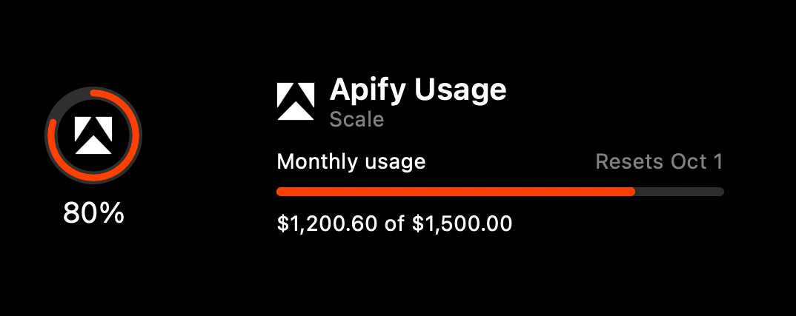

# Apify

Codenotch for macOS reads the number Apify's Console shows under
**Billing → Custom usage limit**: this billing cycle's platform spend against
the monthly cap the account set for itself, and when the cycle rolls over.
Enable or disable Apify in **Settings → Accounts** like any other provider.
Disabling it stops polling, forgets Codenotch's readings and deletes only the
token Codenotch holds itself; an `apify login` is left untouched.

## Readings

- **Monthly usage:** the headline ring is `current.monthlyUsageUsd` over
  `limits.maxMonthlyUsageUsd`, with `.official` fidelity — both numbers are
  Apify's own. The card shows the amounts the way the Console writes them
  (`$1,200.60 of $1,500.00`) and the reset is the cycle's `endAt`. The share
  is not clamped at 100%: the platform pauses at the cap, but what Apify
  reports past it is still the number.
- **No cap set:** a spend-only row (`$1,200.60 this cycle`) with no ring
  fraction. A percentage would have to invent the denominator.
- The other ceilings the endpoint lists — compute units, proxy bandwidth,
  actor counts — are plan sizes rather than the thing that pauses the
  account, so they stay off the card rather than invent readings nobody
  budgets by.

There is no weekly ring and no activity monitoring: Apify has no local agent
sessions to watch. The 80% and 100% alerts are Codenotch's usual ones; the
emails Apify sends as the cap approaches are separate and unaffected.

The screenshot renders the app's actual ring and card from the synthetic test
fixture (`ApifyFixture.limits`, 80% of a $1,500 cap), not live account data:



## Source and credentials

The adapter sends one read-only request per refresh:

```http
GET https://api.apify.com/v2/users/me/limits
Authorization: Bearer <Apify API token>
Accept: application/json
```

The token is taken from the first of these that has one:

1. `APIFY_TOKEN` in the environment — the name the Apify SDKs and CLI read.
2. A token pasted in **Settings → Accounts → Apify**, stored in the login
   keychain under `apify-api-token` (Codenotch's own item, deleted when the
   provider is switched off).
3. `~/.apify/auth.json`, where `apify login` keeps its login. Older CLIs, and
   any CLI run with `APIFY_DISABLE_KEYRING=1`, write the token into the file.
4. The CLI's own keychain item (`com.apify.cli` / `token`), where the current
   CLI keeps the token by default, leaving only the account's metadata in
   `auth.json`. Reading another app's keychain item can raise the macOS
   prompt; the read is cached until the item changes, a Deny is remembered
   rather than retried on a timer, and **Allow access…** in Settings asks
   again. It is never reached while an explicit token exists, and never at
   all on a Mac that has not run `apify login`.

The explicit sources win over the borrowed ones on purpose: pasting a token is
a choice made in Codenotch, and a choice should not be overruled by whichever
account happens to be logged into the CLI. For the same reason the settings row
names the account (email, plan) only when the borrowed login is what is being
read; an exported or pasted token belongs to whatever account issued it, which
nothing on the Mac can say.

No credential is copied, refreshed, logged or written by Codenotch, and the
`PUT /v2/users/me/limits` endpoint that raises the cap is never called —
raising it is a spending decision, and the Console's to make.

A scoped token can be valid and still be refused this endpoint. That answers
403 and is shown as its own message, not as a sign-out; use a token with full
account access. Missing credentials and HTTP 401 show `apify login` guidance,
and a 401 also drops the cached borrowed token so the next read asks the
keychain again. HTTP 429 persists a wait of at least one minute and honours
`Retry-After`, including HTTP dates. Other failures use Codenotch's normal
last-good-reading/stale behaviour.

## Validation

`make test` covers parsing (cap, no cap, past the cap, malformed and negative
values, money formatting), credential precedence and account naming, the HTTP
request, authentication and transport failures, persisted throttling, token
rotation, sign-out scope and the glyph. Tests use synthetic data and isolated
temporary files, URL sessions and preference stores.

After `apify login`, or with `APIFY_TOKEN` exported, the live provider/store
check can be switched on explicitly:

```sh
TEST_RUNNER_CODENOTCH_TEST_APIFY_LIVE=1 make test
```

It prints only the parsed metering values, never the token or account.
Compare the ring with the Console's Billing page; do not commit live
responses, account identifiers or tokens.

## References

- [Get limits](https://docs.apify.com/api/v2/users-me-limits-get) — the
  endpoint and its `monthlyUsageCycle` / `limits` / `current` blocks.
- [API tokens](https://docs.apify.com/platform/integrations/api) — where a
  token is made (Console → Settings → API & Integrations) and the
  `Authorization` header.
- [Apify CLI reference](https://docs.apify.com/cli/docs/reference) — `apify
  login` and `~/.apify/auth.json`; the keyring backend and its service name
  are in the CLI's `src/lib/credentials.ts`.
- The template glyph is Apify's own mark from
  [apify.com/favicon.svg](https://apify.com/favicon.svg) — see
  [`docs/design/provider-assets.md`](../design/provider-assets.md).
